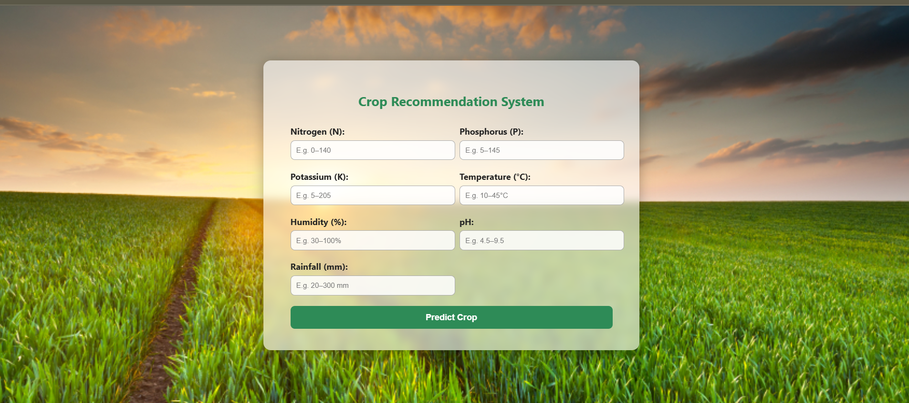
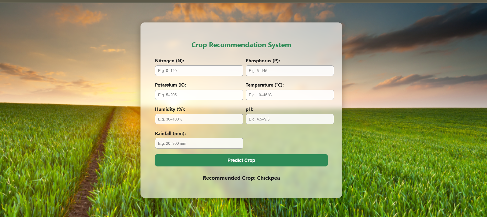

# Crop Recommendation System

A Machine Learning–based web app that suggests suitable crops based on soil and environmental parameters (e.g., N, P, K, pH, temperature, humidity, rainfall).

---

## 🌱 Project Overview

This project leverages machine learning to recommend crop types tailored to a given set of soil and climatic conditions. It includes:

- **Dataset**: `Crop_Recommendation.csv` – multiple samples with features like Nitrogen (N), Phosphorus (P), Potassium (K), pH, Temperature, Humidity, Rainfall, and target crop label.
- **Model Training Notebook**: `Crop Recommendation.ipynb` – data preprocessing, exploratory analysis, model training & evaluation.
- **Pre-trained Model**: Includes `model.pkl`, associated scalers (`minmaxscaler.pkl`, `standscaler.pkl`) for transforming input data.
- **Web App Backend**: `app.py` – Flask application to serve the trained model predictions.
- **Frontend**: `templates/` and `static/` directories – containing HTML, CSS, and any necessary assets for user interaction.

---

## 📂 Directory Structure

Crop-Recommendation-System/
│
├── Crop_Recommendation.csv # Dataset
├── Crop Recommendation.ipynb # Jupyter notebook for training and analysis
├── app.py # Flask app for running the recommendation system
├── model.pkl # Pre-trained ML model
├── minmaxscaler.pkl # Preprocessor: MinMaxScaler
├── standscaler.pkl # Preprocessor: StandardScaler
├── requirements.txt # Project dependencies
├── templates/ # HTML templates for the web interface
└── static/ # CSS, JS, and images for styling and interactivity


---

## 🛠 Installation & Setup

1. **Clone the repo**  
   ```bash
   git clone https://github.com/Syed-Shamsheer-Ali/Crop-Recommendation-System.git
   cd Crop-Recommendation-System


2. **Create a virtual environment**
   ```bash
   python3 -m venv venv
   source venv/bin/activate     # On Windows: venv\Scripts\activate
3. **Install the dependencies**
   ```bash
    pip install -r requirements.txt
4. **Run the Flask app**
    ```bash
    python app.py

## 🚀 Usage  

1. Open the **web interface**.  
2. Enter soil and environmental values in the provided form:  
   - Nitrogen (N)  
   - Phosphorus (P)  
   - Potassium (K)  
   - pH  
   - Temperature  
   - Humidity  
   - Rainfall  
3. Submit to get a **crop recommendation** output instantly from the ML model.  

## 📊 Model Training (Optional)

To retrain or customize the model:

1. Open the **`Crop Recommendation.ipynb`** notebook.  
2. Load the dataset: **`Crop_Recommendation.csv`**.  
3. Perform:  
   - **Preprocessing:** Handle missing values, perform feature scaling.  
   - **Modeling:** Train various ML models (e.g., Decision Tree, Random Forest, SVM, XGBoost).  
   - **Evaluation:** Compare performance using metrics like accuracy, F1-score, etc.  
4. Save a new model and scalers (e.g., using `pickle.dump()`).  
5. Replace the existing **`model.pkl`**, **`minmaxscaler.pkl`**, and/or **`standscaler.pkl`** in the root directory.  


## 📦 Dependencies  

Key Python packages used (check `requirements.txt` for full list):  

  
  
  
  


## 🔮 Future Enhancements  

Consider expanding the project by:  

- **Adding more environmental factors** (soil moisture, sunlight hours, etc.).  
- **Integrating explainable AI techniques** (e.g., LIME, SHAP) to justify recommendations.  
- **Building RESTful API endpoints** for batch processing or integration with other systems.  
- **Deploying the app** using Heroku, Vercel, or similar platforms.  


## 👨‍💻 Credits & License  

- Created by **Syed Shamsheer Ali**.  
- Feel free to reuse, modify, or extend the code with proper attribution.  

## 📸 Screenshots / Demo  

  
*Sample homepage of the Crop Recommendation System*  

  
*Crop prediction output with recommended crop*  
